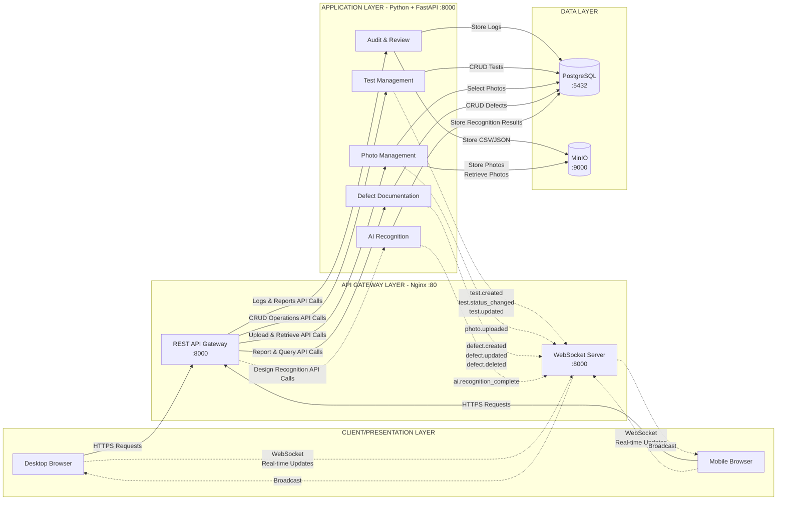

# QC Vision - System Architecture

## Architecture Diagram


For a more clearer architecture diagram use draw.io [here](https://drive.google.com/file/d/15YkJcZwWqBhIJU4S3FyBjxDVHXOc-Kmm/view?usp=sharing)

## Overview

QC Vision follows a **modular monolithic architecture** with clear separation of concerns across four main layers:

1. **Client/Presentation Layer** - Web and mobile interfaces
2. **API Gateway Layer** - REST API and WebSocket server
3. **Application Layer** - Core business logic modules
4. **Data Layer** - PostgreSQL database and MinIO object storage

## Architecture Layers

### Client/Presentation Layer

The client layer consists of:
- **Desktop Browser** - Full-featured web application
- **Mobile Browser** - Touch-optimized responsive interface

Both clients communicate with the backend through:
- HTTPS requests for REST API calls
- WebSocket connections for real-time updates

### API Gateway Layer (Nginx :80)

**REST API Gateway (:8000)**
- Handles all HTTP/HTTPS requests
- Routes to appropriate application modules
- Provides `/api/v1/*` endpoints

**WebSocket Server (:8000)**
- Manages persistent connections for real-time updates
- Broadcasts events to all connected clients
- Endpoint: `/ws`

### Application Layer (Python + FastAPI :8000)

**Unified Backend Service:**
All modules run within a single FastAPI application, providing:

**Core Modules:**
- **Test Management** - Create and manage quality tests, track status, link to orders
- **Photo Management** - Upload, store, and retrieve product photos
- **Defect Documentation** - Report and track quality defects with visual annotations
- **Audit & Review** - Logging, search, reporting, and data export
- **AI Recognition** - Design recognition from photos (integrated in same service)

### Data Layer

**PostgreSQL (:5432)**
- Stores structured data (tests, photos metadata, defects, users, audit logs)
- Handles all CRUD operations
- Provides relational data integrity

**MinIO (:9000)**
- S3-compatible object storage
- Stores photo files and export files
- Optimized for large binary data

## Data Flow

### Request Flow
```
Client → API Gateway → Application Module → Database/Storage → Response
```

### Real-time Event Flow
```
Application Module → WebSocket Server → Broadcast → All Connected Clients
```

## WebSocket Events

The system uses WebSocket for real-time collaboration:

**Test Management Events:**
- `test.created` - New test created
- `test.status_changed` - Test status updated
- `test.updated` - Test details modified

**Photo Management Events:**
- `photo.uploaded` - New photo uploaded

**Defect Documentation Events:**
- `defect.created` - New defect reported
- `defect.updated` - Defect details modified
- `defect.deleted` - Defect removed

**AI Recognition Events:**
- `ai.recognition_complete` - AI processing finished

## Technology Stack

**Frontend:**
- React + Vite (or Next.js)
- ShadcnUI + Tailwind CSS
- React Query (data fetching)

**Backend:**
- Python 3.11+
- FastAPI (REST API + WebSocket)
- SQLAlchemy (PostgreSQL ORM)
- Alembic (database migrations)
- python-multipart (file uploads)
- python-jose[cryptography] (JWT authentication)
- Pillow (image processing)
- boto3 (MinIO/S3 integration)
- TensorFlow/PyTorch or OpenAI API (AI recognition)

**Database:**
- PostgreSQL 15+

**Object Storage:**
- MinIO (S3-compatible)

**Reverse Proxy:**
- Nginx

**Deployment:**
- Docker + Docker Compose

## Port Configuration

| Service | Port(s) | Purpose |
|---------|---------|---------|
| Nginx | 80, 443 | Reverse proxy, serve frontend |
| FastAPI Backend | 8000 | REST API + WebSocket server (all modules) |
| PostgreSQL | 5432 | Database |
| MinIO API | 9000 | Object storage API |
| MinIO Console | 9001 | MinIO web interface |

## Connection Types

- **Solid lines (→)** - Required, synchronous connections
- **Dashed lines (⇢)** - Optional or asynchronous connections
