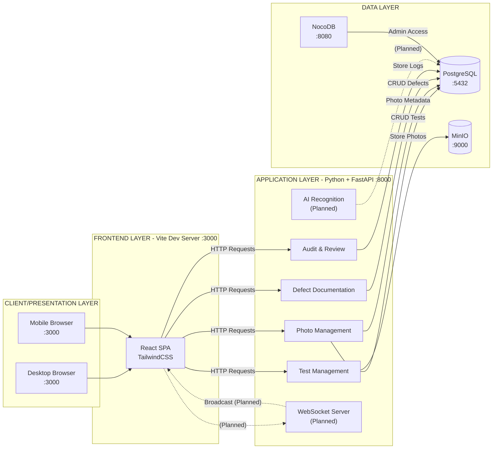

# QC Vision - System Architecture

## Architecture Diagram



For a clearer architecture diagram, use draw.io [here](https://drive.google.com/file/d/15YkJcZwWqBhIJU4S3FyBjxDVHXOc-Kmm/view?usp=sharing)

## Overview

QC Vision follows a **modular monolithic architecture** with clear separation of concerns across four main layers:

1. **Client/Presentation Layer** - Web and mobile browser interfaces
2. **Frontend Layer** - React SPA served by Vite dev server
3. **Application Layer** - Core business logic modules (FastAPI)
4. **Data Layer** - PostgreSQL database, MinIO object storage, and NocoDB admin

## Architecture Layers

### Client/Presentation Layer

The client layer consists of:
- **Desktop Browser** - Full-featured web application
- **Mobile Browser** - Touch-optimized responsive interface

Both clients access the React SPA served on port 3000.

### Frontend Layer (Vite :3000)

**React Single Page Application:**
- Built with React + Vite for fast development
- TailwindCSS for styling
- Communicates with backend via REST API calls

### Application Layer (Python + FastAPI :8000)

**Unified Backend Service:**
All modules run within a single FastAPI application, providing:

**Implemented Modules:**
- **Test Management** - Create and manage quality tests, track status, link to orders
- **Photo Management** - Upload, store, and retrieve product photos via MinIO
- **Defect Documentation** - Report and track quality defects with visual annotations
- **Audit & Review** - Action logging with filtering and search

**Planned Modules:**
- **AI Recognition** - Design recognition from photos
- **WebSocket Server** - Real-time updates and collaboration

### Data Layer

**PostgreSQL (:5432)**
- Stores structured data (tests, photos metadata, defects, audit logs)
- Handles all CRUD operations
- Provides relational data integrity

**MinIO (:9000, :9001)**
- S3-compatible object storage
- Stores photo files
- Console available on port 9001 for administration

**NocoDB (:8080)**
- Database admin UI
- Provides spreadsheet-like interface to PostgreSQL data
- Useful for data management and debugging

## Data Flow

### Request Flow
```
Client → React SPA (:3000) → FastAPI Backend (:8000) → Database/Storage → Response
```

### Photo Upload Flow
```
Client → React SPA → POST /api/v1/photos/upload → MinIO Storage + DB Metadata → Response
```

### Photo Retrieval Flow
```
Client → React SPA → GET /api/v1/photos/{id}/image → Backend Proxy → MinIO → Image Response
```

## WebSocket Events *(Planned)*

The system will use WebSocket for real-time collaboration:

**Test Management Events:**
- `test.created` - New test created
- `test.status_changed` - Test status updated
- `test.updated` - Test details modified

**Photo Management Events:**
- `photo.uploaded` - New photo uploaded

**Defect Documentation Events:**
- `defect.created` - New defect reported
- `defect.updated` - Defect details modified
- `defect.deleted` - Defect removed

**AI Recognition Events:**
- `ai.recognition_complete` - AI processing finished

## Technology Stack

**Frontend:**
- React 18 + Vite
- TailwindCSS
- ShadcnUI components

**Backend:**
- Python 3.11+
- FastAPI (REST API)
- SQLAlchemy (PostgreSQL ORM)
- python-multipart (file uploads)
- minio (MinIO/S3 integration)
- Pillow (image processing)

**Database:**
- PostgreSQL 15

**Object Storage:**
- MinIO (S3-compatible)

**Admin UI:**
- NocoDB

**Deployment:**
- Docker + Docker Compose

## Port Configuration

| Service | Port(s) | Purpose |
|---------|---------|---------|
| Vite Frontend | 3000 | React SPA dev server |
| FastAPI Backend | 8000 | REST API (all modules) |
| PostgreSQL | 5432 | Database |
| MinIO API | 9000 | Object storage API |
| MinIO Console | 9001 | MinIO web interface |
| NocoDB | 8080 | Database admin UI |

## Docker Containers

| Container | Image | Purpose |
|-----------|-------|---------|
| `qc_vision_frontend` | Custom (Vite) | React SPA |
| `qc_vision_backend` | Custom (Python) | FastAPI application |
| `qc_vision_postgres` | postgres:15-alpine | PostgreSQL database |
| `qc_vision_minio` | minio/minio:latest | Object storage |
| `qc_vision_nocodb` | nocodb/nocodb:latest | Database admin UI |

## Connection Types

- **Solid lines (`-->`)** - Implemented, synchronous connections
- **Dashed lines (`-.->`)** - Planned or asynchronous connections
