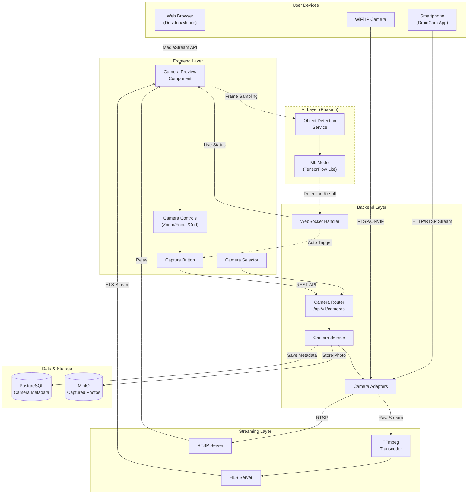
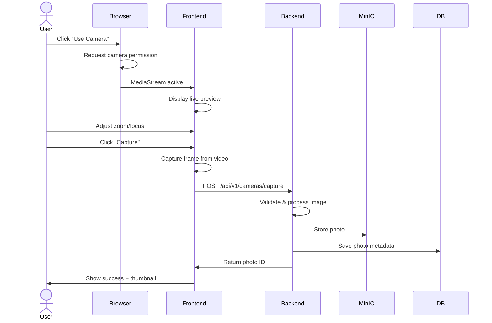
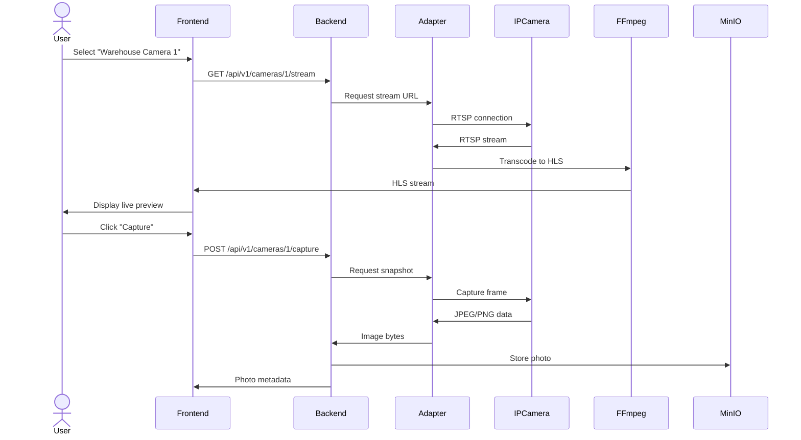
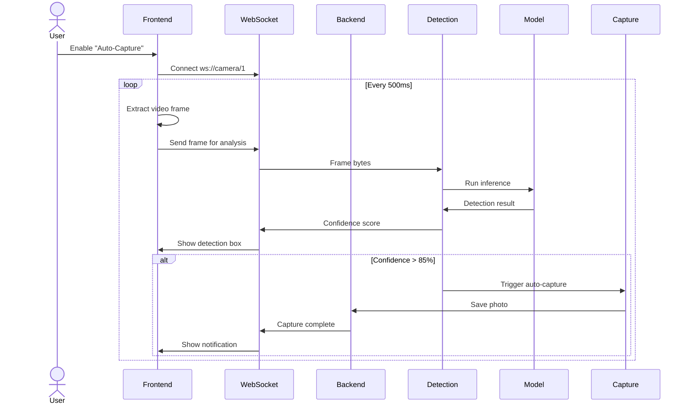
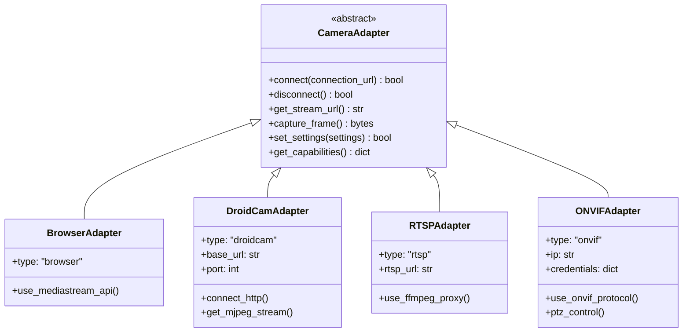
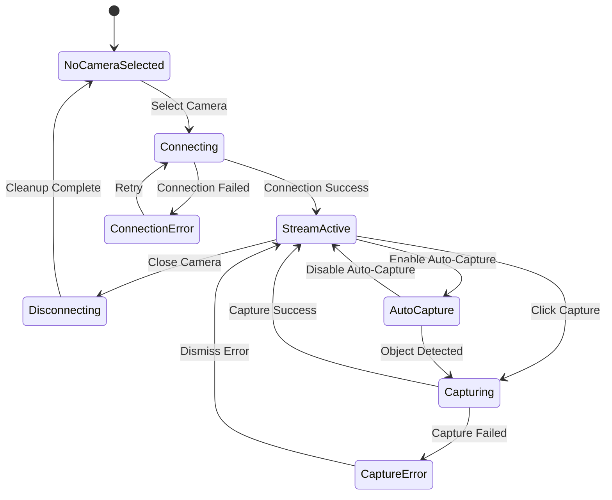
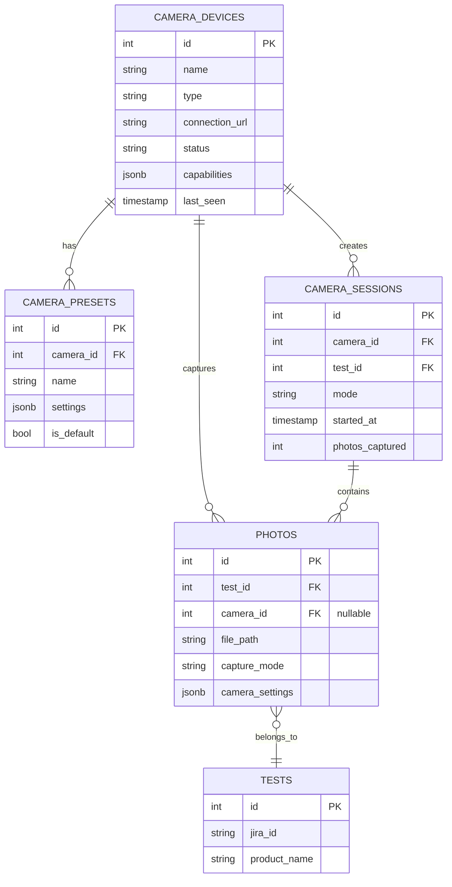

# Camera IoT Architecture Diagram

## High-Level Architecture



## Component Interaction Flow

### Flow 1: Browser Camera Capture (Phase 1)


### Flow 2: WiFi Camera Capture (Phase 4)


### Flow 3: Auto-Capture with AI Detection (Phase 5)


## Camera Adapter Architecture



## Frontend State Management



## Data Model Relationships



## Technology Stack Overview

```mermaid
graph LR
    subgraph Frontend["Frontend Stack"]
        A[React + TypeScript]
        B[MediaStream API]
        C[Canvas API]
        D[WebSocket Client]
    end

    subgraph Backend["Backend Stack"]
        E[FastAPI]
        F[SQLAlchemy]
        G[WebSocket Server]
        H[Python Adapters]
    end

    subgraph Streaming["Streaming Stack"]
        I[FFmpeg]
        J[HLS Server]
        K[RTSP Relay]
    end

    subgraph AI["AI Stack - Phase 5"]
        L[TensorFlow Lite]
        M[OpenCV]
        N[YOLO/MobileNet]
    end

    Frontend --> Backend
    Backend --> Streaming
    Streaming --> Frontend
    Frontend -.-> AI
    AI -.-> Backend

    style AI stroke-dasharray: 5 5
    style Frontend fill:#e1f5ff
    style Backend fill:#fff4e1
    style Streaming fill:#f0e1ff
    style AI fill:#e1ffe1
```



---

## Phase-wise Architecture Evolution

### Phase 1: Browser Camera Only
```
User Browser → MediaStream API → React Preview → Canvas Capture → Backend Upload → MinIO
```

### Phase 3: + Smartphone Integration
```
                        ┌→ Browser Camera (above)
User Device Selection → │
                        └→ DroidCam → HTTP Stream → Backend Proxy → Frontend Preview
```

### Phase 4: + WiFi Cameras
```
                        ┌→ Browser Camera
User Device Selection → ├→ DroidCam
                        └→ WiFi Camera → RTSP → FFmpeg → HLS → Frontend Preview
```

### Phase 5: + AI Auto-Capture
```
Frontend Preview → Frame Sampling → WebSocket → Detection Service → ML Model
                                                      ↓
                                              Confidence > 85%
                                                      ↓
                                              Auto Trigger Capture
```

---

## Network Architecture

```
┌─────────────────────────────────────────────────────────────┐
│  LAN / Internal Network                                      │
│                                                              │
│  ┌──────────┐        ┌──────────┐        ┌──────────┐     │
│  │ DroidCam │        │ WiFi IP  │        │ WiFi IP  │     │
│  │ @ :4747  │        │ Camera 1 │        │ Camera 2 │     │
│  └────┬─────┘        └────┬─────┘        └────┬─────┘     │
│       │                   │                    │            │
│       └───────────────────┴────────────────────┘            │
│                           │                                 │
│                    ┌──────▼──────┐                         │
│                    │   Backend   │                         │
│                    │   :8000     │                         │
│                    └──────┬──────┘                         │
│                           │                                 │
│                    ┌──────▼──────┐                         │
│                    │  Streaming  │                         │
│                    │   :8554     │                         │
│                    └──────┬──────┘                         │
└───────────────────────────┼─────────────────────────────────┘
                            │
                     ┌──────▼──────┐
                     │  Frontend   │
                     │   :3000     │
                     └─────────────┘
                            ▲
                            │
                     ┌──────┴──────┐
                     │   Users     │
                     └─────────────┘
```

---

**Diagram Version**: 1.0
**Last Updated**: March 11, 2026
